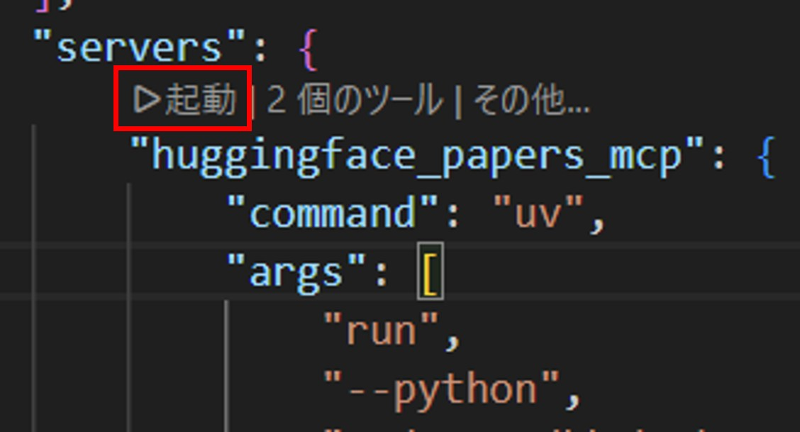
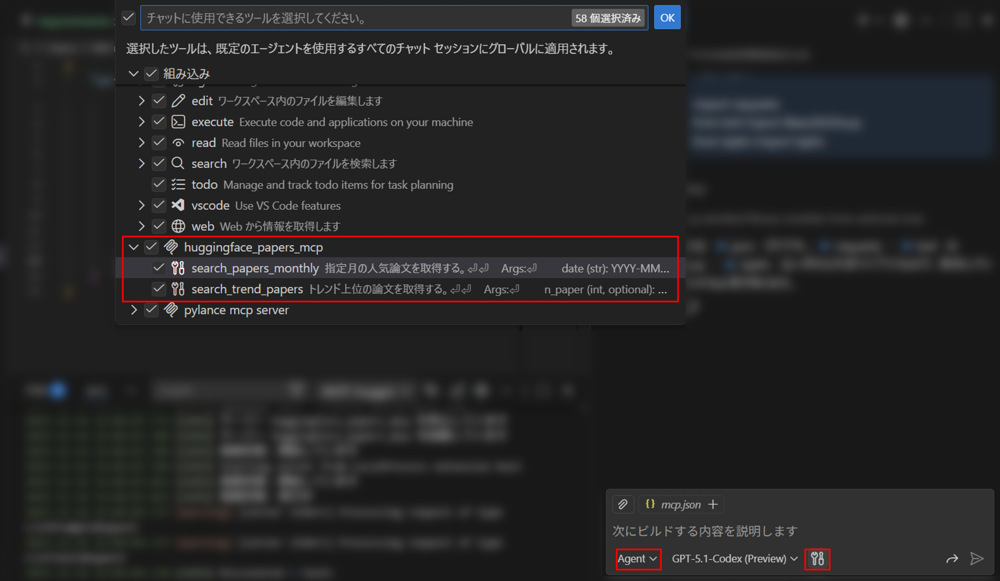
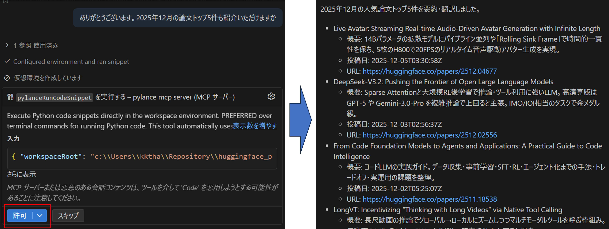
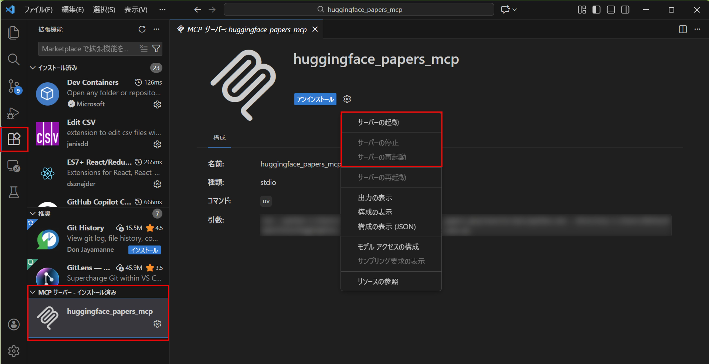

# Hugging Face Papers MCP Server

## 概要
- このMCPサーバーは `https://huggingface.co/papers/` からトレンド／月間トップ論文をスクレイピングし、タイトル・概要・論文URL・公開日時を返すツールを提供します。
- 提供ツールは `search_trend_papers(n_paper)` と `search_papers_monthly(date, n_paper)` の2種類で、内部的には `create_hf_papers_json_feed()` を利用してHugging FaceのJSON Feedを生成しています。

## GitHub Copilotでの利用手順
1. このリポジトリをクローンします。
   ```bash
   git clone https://github.com/NRT-ML/huggingface_papers_mcp.git
```
1. uv仮想環境を構築 & ライブラリインストール。
   ```bash
   cd to huggingface_papers_mcp
   uv venv venv --python 3.11
   venv\Scripts\activate  
   uv install -r requirements.txt   
   ```
2. GitHub Copilot用のMCP設定ファイルを作成／更新します。Windowsでは `C:\Users\[ユーザー名]\AppData\Roaming\Code\User\mcp.json`が既定です。
     ```json
     "servers": {
        "huggingface_papers_mcp": {
            "command": "uv",
            "args": [
                "--python",
                "path/to/your/venv/Scripts/python.exe",
                "--directory",
                "/PATH/TO/DIR/huggingface_papers_mcp",
                "run",
                "huggingface_papers_mcp.py"
            ],
        }
    }
     ```
4. MCPサーバーを起動します。
  

5. Agentモードを選択し、工具ボタンからMCPサーバが認識されていることを確認します。
  

6. VS CodeでGitHub Copilot Chatを開き、実際に動作を試します。
  

7. MCPサーバの停止,再起動はVSCodeの拡張機能タブから実施できます。
  

## Acknowledgements
Json feedの作成にあたっては以下を参考にしました。

https://github.com/capjamesg/hugging-face-papers-rss